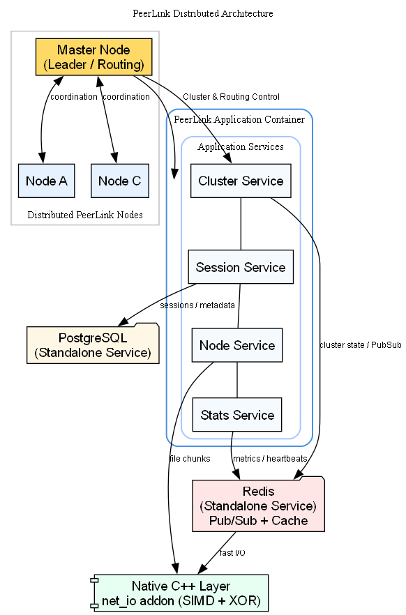

# PeerLink


> **A high-performance, open-source distributed file sharing platform engineered for scale.**

---

## Table of Contents

- [Introduction](#-introduction)
- [System Architecture](#-system-architecture)
  - [Microservices &amp; Modularity](#microservices--modularity)
  - [The Cluster Protocol](#the-cluster-protocol)
  - [Native Performance Layer](#native-performance-layer)
- [Tech Stack](#-tech-stack)
- [Getting Started](#-getting-started)
  - [Prerequisites](#prerequisites)
  - [Installation](#installation)
- [Configuration](#-configuration)
- [Running the Application](#-running-the-application)
- [Contributing](#-contributing)

---

## Introduction

PeerLink is not just a file transfer tool; it is a sophisticated distributed system designed to handle high-throughput data transfer across a clustered environment. Built with a "performance-first" mindset, it leverages a microservices-inspired architecture to ensure that no single point of failure exists.

Whether you are running a single instance or a fleet of nodes across different continents, PeerLink's intelligent routing layer ensures your data gets where it needs to go—instantly.

---

## Showcase



[**Watch the Demo Video**](showcase/demo.mp4):

---

## System Architecture

PeerLink moves away from the traditional monolithic server model. Instead, it operates as a collection of intelligent **Nodes** that form a cooperative cluster. **These nodes are fully decoupled and can run on separate physical machines, different cloud regions, or distinct containers, creating a truly distributed network.**

### Microservices & Modularity

The backend is strictly decoupled into autonomous services, each responsible for a specific domain. This modularity allows for independent scaling and maintenance.

**Application Services:**

* **Cluster Service**: The brain of the operation. It manages leader election, node discovery, and inter-node routing.
* **Session Service**: Handles user state, authentication, and connection persistence across the cluster.
* **Node Service**: Manages the lifecycle of individual worker nodes, performing health checks and self-healing routines.
* **Stats Service**: Aggregates real-time metrics from all nodes to provide a holistic view of system health.

**Infrastructure Services:**

* **PostgreSQL Database**: Operates as a completely separate, dedicated service for persistent data storage, ensuring data integrity independent of application nodes.
* **Redis**: Runs as a standalone high-performance service handling caching, Pub/Sub messaging, and cluster coordination.

### The Cluster Protocol

How do nodes talk to each other? We built a custom event-driven backbone using **Redis Pub/Sub**.

1. **Leader Election**: Nodes automatically elect a "Master" node to handle complex routing decisions and cluster-wide synchronization.
2. **Smart Routing**: If User A (on Node 1) sends a file to User B (on Node 2), the system identifies the target node and routes the data stream internally. The users never know they are on different servers.
3. **State Consistency**: All session states are persisted in PostgreSQL but cached in Redis for millisecond-level access speeds.
4. **Dynamic Scaling**: The system supports hot-swappable nodes. As you spin up new Docker containers, the frontend automatically discovers them via Redis, enabling seamless horizontal scaling with zero downtime.

### Native Performance Layer

JavaScript is fast, but C++ is faster. For CPU-intensive tasks, we bypass the Node.js event loop and drop down to bare metal.

* **`net_io` Addon**: A custom C++ N-API module built specifically for PeerLink.
* **SIMD Checksums**: We utilize AVX/SSE instructions to calculate file integrity hashes 400% faster than standard crypto libraries.
* **XOR Cipher**: Real-time stream obfuscation with zero latency overhead.

---

## Tech Stack

| Component           | Technology   | Description                                        |
| ------------------- | ------------ | -------------------------------------------------- |
| **Frontend**  | React + Vite | Ultra-fast UI rendering and bundling.              |
| **Styling**   | Tailwind CSS | Utility-first CSS for consistent design.           |
| **Runtime**   | Node.js      | Asynchronous event-driven JavaScript runtime.      |
| **Language**  | TypeScript   | Strict typing for robust, error-free code.         |
| **Transport** | Socket.IO    | Real-time bidirectional event-based communication. |
| **Database**  | PostgreSQL   | Relational data integrity for sessions and nodes.  |
| **ORM**       | Prisma       | Type-safe database access and schema management.   |
| **Cache/Msg** | Redis        | High-performance caching and Pub/Sub messaging.    |
| **Native**    | C++ (N-API)  | Low-level optimization for critical paths.         |

---

## Getting Started

### Prerequisites

Ensure your environment is ready for high-performance computing.

* **Node.js**: v18.0.0 or higher
* **PostgreSQL**: v14+
* **Redis**: v6+ (Essential for Cluster Mode)
* **Build Tools**: Python 3 & C++ compiler (Visual Studio Build Tools on Windows, `build-essential` on Linux) for compiling the native addon.

### Installation

1. **Clone the Repository**

   ```bash
   git clone https://github.com/yourusername/peerlink.git
   cd peerlink
   ```
2. **Backend Setup**

   ```bash
   cd backend
   npm install

   # Configure Environment
   cp .env.example .env
   # EDIT .env with your DB/Redis credentials!

   # Initialize Database
   npm run prisma:generate
   npm run prisma:push
   ```
3. **Frontend Setup**

   ```bash
   cd frontend
   npm install
   cp .env.example .env
   ```

---

## Configuration

PeerLink is designed to be flexible. Control every aspect of the system via environment variables.

### Backend Configuration (`backend/.env`)

#### Database

| Variable         | Default              | Description                       |
| ---------------- | -------------------- | --------------------------------- |
| `DATABASE_URL` | `postgresql://...` | Connection string for PostgreSQL. |

#### Server & Cluster

| Variable          | Default         | Description                                                  |
| ----------------- | --------------- | ------------------------------------------------------------ |
| `PORT`          | `5000`        | The port the server listens on.                              |
| `NODE_ENV`      | `development` | Environment mode (`development` or `production`).        |
| `NODE_HOSTNAME` | `localhost`   | Hostname for this specific node (used in cluster discovery). |
| `NODE_PORT`     | `5000`        | Port for this specific node.                                 |

#### Redis (Caching & Pub/Sub)

| Variable                  | Default       | Description                           |
| ------------------------- | ------------- | ------------------------------------- |
| `REDIS_HOST`            | `localhost` | Redis server hostname.                |
| `REDIS_PORT`            | `6379`      | Redis server port.                    |
| `REDIS_PASSWORD`        | -             | Redis password (leave empty if none). |
| `REDIS_DB`              | `0`         | Redis database index.                 |
| `REDIS_MAX_RETRIES`     | `3`         | Max connection retries.               |
| `REDIS_RETRY_DELAY`     | `100`       | Delay between retries (ms).           |
| `REDIS_CONNECT_TIMEOUT` | `10000`     | Connection timeout (ms).              |

#### Redis TTL (Time-To-Live)

| Variable                  | Default   | Description                                |
| ------------------------- | --------- | ------------------------------------------ |
| `TTL_CLIENT_SESSION`    | `3600`  | Session duration in seconds (1 hour).      |
| `TTL_SHARE_SESSION`     | `86400` | Share link duration in seconds (24 hours). |
| `TTL_UPLOAD_STATE`      | `7200`  | Upload state retention (2 hours).          |
| `TTL_RATE_LIMIT_WINDOW` | `60`    | Rate limit window (1 minute).              |
| `TTL_HEARTBEAT`         | `300`   | Node heartbeat expiration (5 minutes).     |

#### Security & Rate Limiting

| Variable                                     | Default                   | Description                       |
| -------------------------------------------- | ------------------------- | --------------------------------- |
| `CORS_ORIGIN`                              | `http://localhost:5173` | Allowed frontend origin.          |
| `RATE_LIMIT_UPLOADS_PER_MINUTE`            | `100`                   | Max uploads per user/min.         |
| `RATE_LIMIT_DOWNLOADS_PER_MINUTE`          | `100`                   | Max downloads per user/min.       |
| `RATE_LIMIT_WEBSOCKET_MESSAGES_PER_MINUTE` | `1000`                  | Max socket messages per user/min. |

#### File Transfer

| Variable                     | Default        | Description                          |
| ---------------------------- | -------------- | ------------------------------------ |
| `MAX_FILE_SIZE`            | `1073741824` | Max file size in bytes (1GB).        |
| `CHUNK_SIZE`               | `16384`      | Size of each file chunk (16KB).      |
| `MAX_CONCURRENT_UPLOADS`   | `10`         | Max simultaneous uploads per node.   |
| `MAX_CONCURRENT_DOWNLOADS` | `10`         | Max simultaneous downloads per node. |
| `MAX_CONCURRENT_TRANSFERS` | `5`          | Max active transfers per user.       |
| `ACK_TIMEOUT_MS`           | `10000`      | Timeout for chunk acknowledgement.   |
| `MAX_RETRIES`              | `3`          | Max retries for failed chunks.       |

#### Performance & Features

| Variable               | Default  | Description                               |
| ---------------------- | -------- | ----------------------------------------- |
| `USE_NATIVE_ADDON`   | `true` | Enable C++ SIMD optimizations.            |
| `USE_REDIS`          | `true` | Enable Redis (Required for Cluster).      |
| `USE_CLUSTER`        | `true` | Enable distributed cluster mode.          |
| `ENABLE_COMPRESSION` | `true` | Enable WebSocket per-message compression. |
| `ENABLE_METRICS`     | `true` | Enable Prometheus-style metrics.          |

---

### Frontend Configuration (`frontend/.env`)

#### API & Network

| Variable             | Default                   | Description                  |
| -------------------- | ------------------------- | ---------------------------- |
| `VITE_BACKEND_URL` | `http://localhost:5000` | URL of the backend API.      |
| `VITE_WS_URL`      | `http://localhost:5000` | URL of the WebSocket server. |

#### Cluster Configuration

| Variable               | Default   | Description                                                 |
| ---------------------- | --------- | ----------------------------------------------------------- |
| `VITE_USE_CLUSTER`   | `false` | Enable dynamic load balancing and node discovery.           |
| `VITE_CLUSTER_NODES` | `...`   | Initial list of backend nodes for bootstrapping connection. |

#### Transfer Settings

| Variable                    | Default   | Description                    |
| --------------------------- | --------- | ------------------------------ |
| `VITE_CHUNK_SIZE`         | `65536` | Chunk size for uploads (64KB). |
| `VITE_UPLOAD_CONCURRENCY` | `6`     | Parallel chunk uploads.        |

#### Socket Settings

| Variable                               | Default  | Description                      |
| -------------------------------------- | -------- | -------------------------------- |
| `VITE_SOCKET_RECONNECTION_DELAY`     | `1000` | Initial reconnection delay (ms). |
| `VITE_SOCKET_RECONNECTION_DELAY_MAX` | `5000` | Max reconnection delay (ms).     |
| `VITE_SOCKET_RECONNECTION_ATTEMPTS`  | `5`    | Max reconnection attempts.       |

---

## Running the Application

### Development Mode

Run the full stack with hot-reloading enabled.

**Terminal 1 (Backend):**

```bash
cd backend
npm run dev
```

**Terminal 2 (Frontend):**

```bash
cd frontend
npm run dev
```

### Production Build

Compile the TypeScript code and build the C++ native addons for maximum performance.

```bash
# Build Backend (includes C++ compilation)
cd backend
npm run build
npm run copy-native
npm start

# Build Frontend
cd frontend
npm run build
```

---

## Docker Deployment

PeerLink is fully containerized and ready for production deployment using Docker Compose.

### Prerequisites

* **Docker** and **Docker Compose** installed.

### Running with Docker

1. **Build and Start Services**

   ```bash
   docker-compose up --build
   ```

   This will start:

   * **Frontend**: `http://localhost`
   * **Backend**: `http://localhost:5000`
   * **PostgreSQL**: Port 5432 (Separate Service)
   * **Redis**: Port 6379 (Separate Service)
2. **Scale Up (Hot Swapping)**
   To demonstrate dynamic scaling, you can spin up multiple backend nodes:

   ```bash
   docker-compose up -d --scale backend=3
   ```

   The frontend will automatically discover the new nodes via Redis.

---

## Contributing

We welcome contributions from the community. However, to maintain the high stability standards of PeerLink, we have strict guidelines.

### Reporting Bugs

If you encounter an issue, **you must provide a complete reproduction path**. Vague reports like "it doesn't work" will be closed immediately without review.

**Required Format for Issues:**

1. **Environment**: OS, Node Version, Browser.
2. **Configuration**: Are you using Cluster Mode? Redis? Native Addons?
3. **Steps to Reproduce**: A numbered list of exact actions taken.
4. **Logs**: Paste the full error stack trace from the backend terminal and browser console.

### Feature Requests

Have an idea to make PeerLink even faster? Open a Pull Request! Please ensure your code follows the existing modular structure and includes proper typing.

---

*Built with precision. Engineered for speed.*
